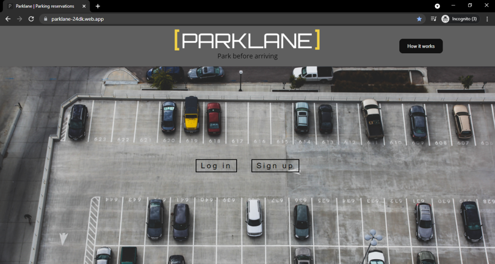
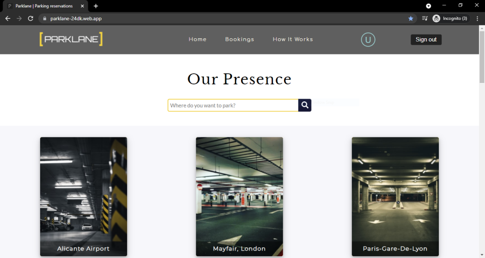

# Parklane

A Parking Reservation Web App, where user can book Car Parks / Parking Lots / Airport Parking at various places across the world.





## Features
* User Authentication (Sign up / Log in)
* 18 places to choose from (airports, hotels etc.)
* Aesthetic UI
* Bookings tab which keeps a track of all booked tickets
* Auto-logout after 1 hour
* Cross-browser, cross-platform support

## Development

Install all the required packages/dependencies using npm
```
npm install
```
Serve the app to browser
```
npm start
```

## License
[MIT](https://github.com/DivyamKakkar24/Parklane/blob/94d8b13137b69db3c85fddeabccdea615428e33e/LICENSE)

#
>Made with 🤍
